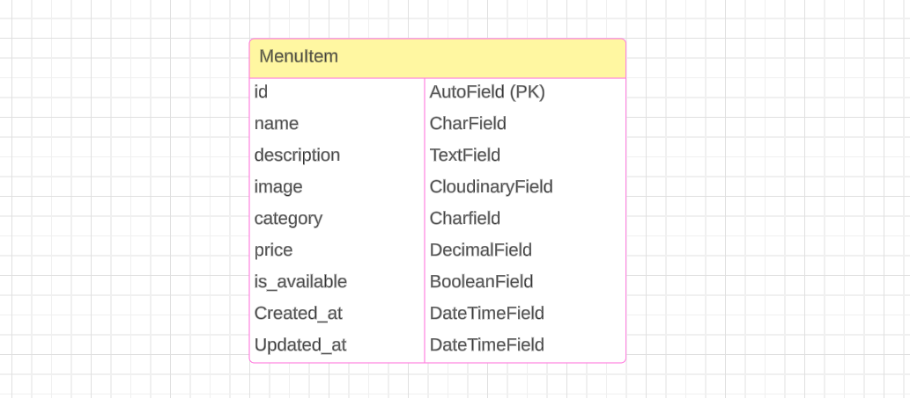
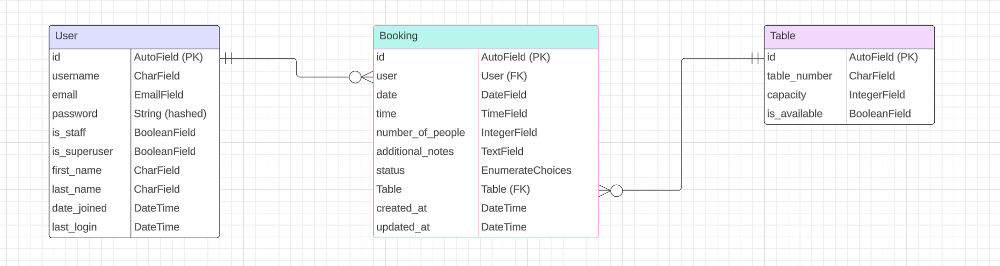
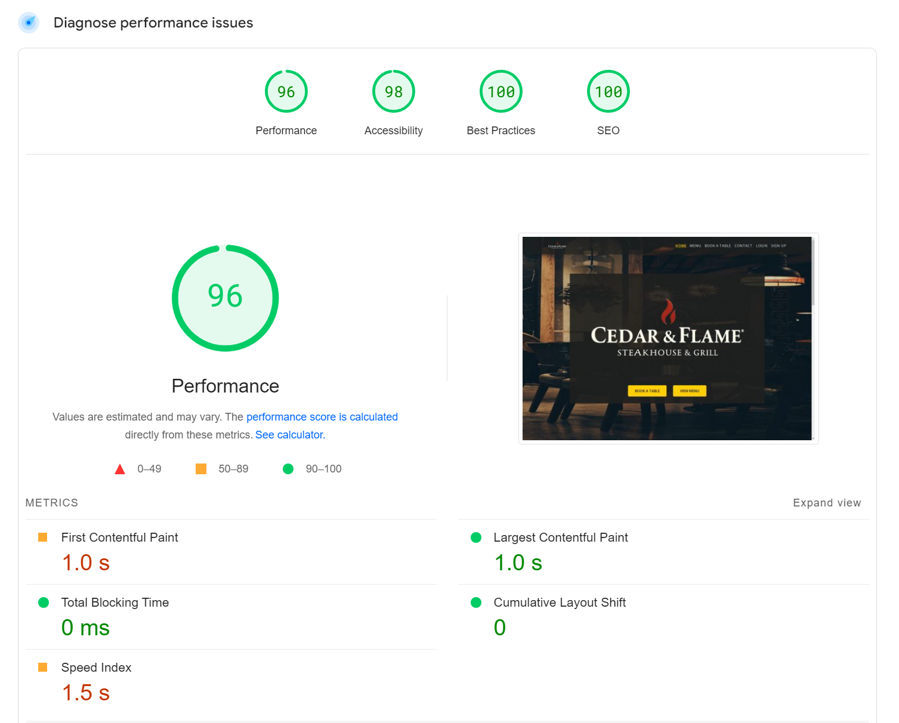
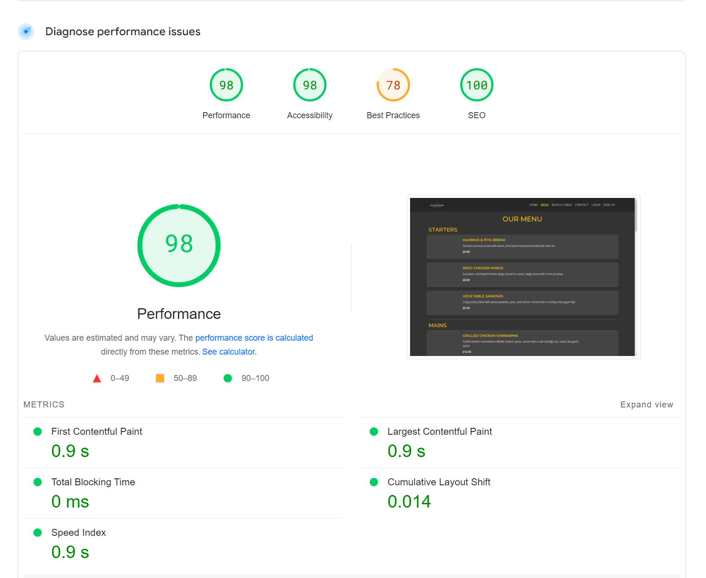
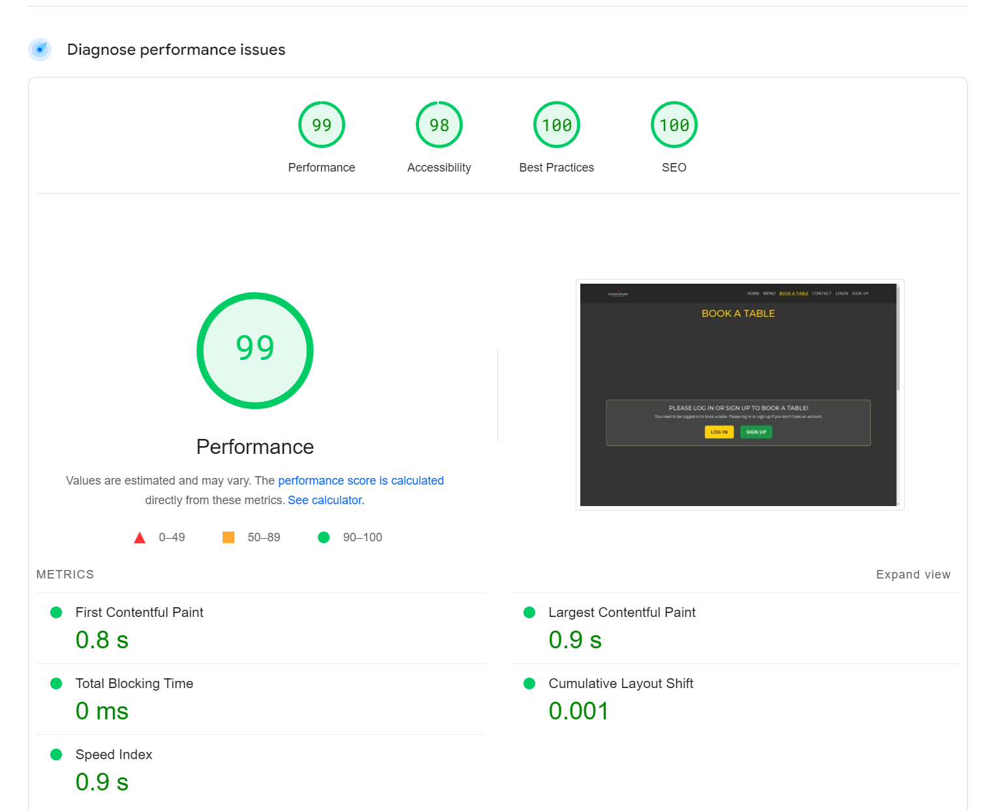
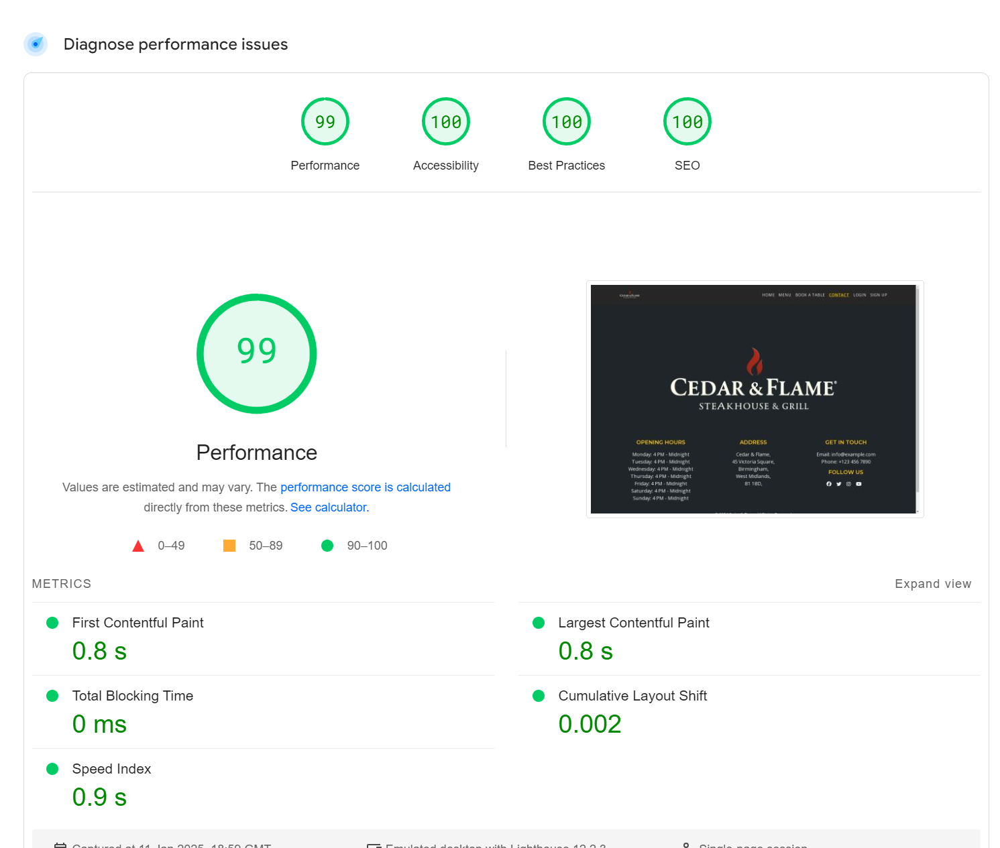
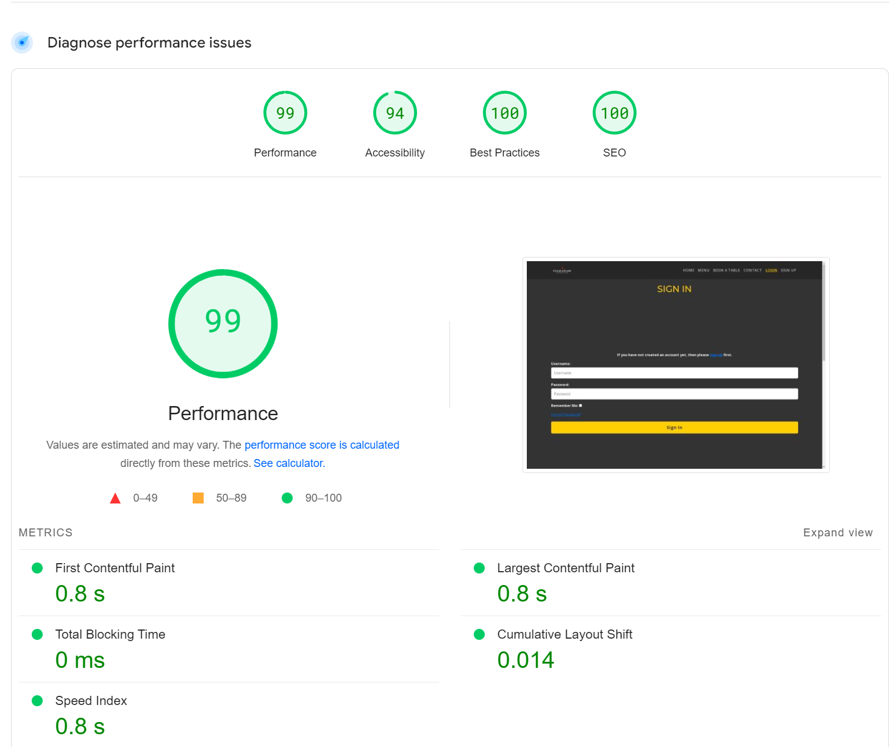
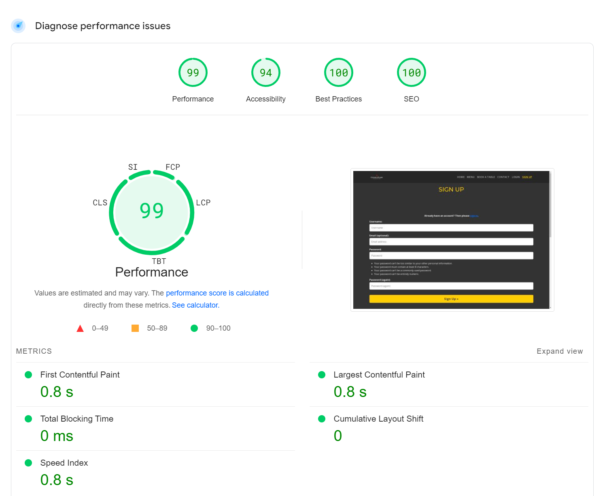
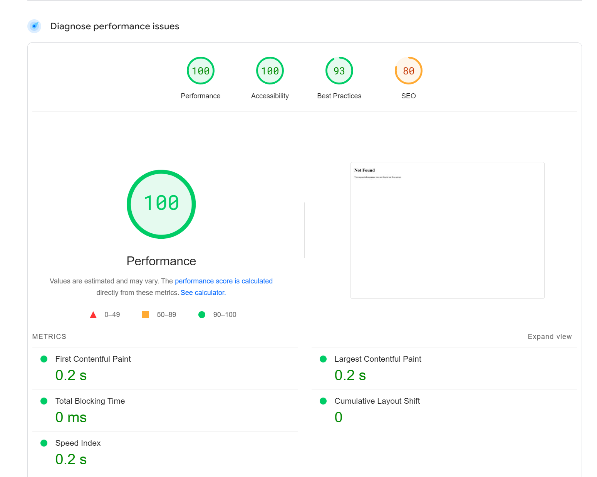

# Cedar & Flame


A Restaurant Web-App developed using Django

Source code can be found [here](https://github.com/MFS4711/Restaurant-Web-App)

The live project can be viewed [here](https://cedar-and-flame-8fe4b04c0330.herokuapp.com/)

---

## Table of Contents

[**Purpose of Project**](#purpose-of-project)

[**Features**](#features)
- [All Users](#all-users)
- [Authenticated (Logged in) Users](#authenticated-logged-in-users)
- [Staff (Authenticated)](#staff-authenticated)
- [Future Features](#future-features)

[**User Experience**](#User-Experience)
- [Design](#design)
    - [Fonts](#fonts)
    - [Colour](#colour)
    - [Wireframes](#wireframes)

[**Development Process**](#development-process)
- [Project Planning](#project-planning-and-documentation-using-gitHub)
- [Search Engine Optimization](#search-engine-optimization)
- [Data Model](#data-model)
- [Data Validation](#data-validation)

[**Testing**](#Testing)
- [Manual Testing](#manual-testing)
    - [Feature Testing](#feature-testing)
    - [Responsiveness](#responsiveness)
    - [Lighthouse](#lighthouse)
- [Validation Testing](#validation-testing)
- [User Story Testing](#user-story-testing)
- [Automated Testing](#automated-testing)

[**Bugs**](#Bugs)

[**Libraries and Programs Used**](#libraries-and-programs-used)

[**Deployment**](#Deployment)
- [Making a Local Clone](#making-a-local-clone)
- [Running in Local Environment](#running-in-local-environment)
- [Deploying to Heroku](#deploying-to-heroku)

[**Credits**](#credits)

[**Acknowledgements**](#acknowledgements)

---

# Purpose of Project

The Restaurant Web App is designed to streamline the management of reservations, menu items, and restaurant operations. It aims to enhance the dining experience for customers by providing an intuitive platform for booking tables, while simplifying restaurant tasks for staff and administrators. The app is built to improve efficiency, reduce errors, and foster better communication between customers, staff, and management, ultimately creating a smoother, more enjoyable restaurant experience.

The primary users of the Restaurant Web App are customers, staff, and restaurant administrators. Customers use the platform to easily manage their reservations, browse menu items, and track their reservation status. Staff members interact with the app to manage and update reservations, ensure menu items are available, and assist with operational tasks. Administrators and managers utilise the app to oversee operations and analyse restaurant performance. Each group is provided with tailored functionality based on their role to ensure smooth and efficient restaurant operations.


---

[Return to top](#cedar--flame)

# Features

This section outlines the key features available to different types of users within the project. It describes pages and functionalities accessible to all users, authenticated users, and staff, highlighting the significance of each feature. Additionally, it includes a look at potential future features that could further enhance the user experience.

## All Users
The following pages are visible to all users, logged in or not.

<details>
<summary>Homepage (landing page)</summary>

### Key Features  

- **Primary Actions**:  
  The landing page offers users two clear options:  
  - View the Menu  
  - Book a Table  

- **Header Navigation**:  
  The header includes the following elements, displayed left to right:  
  - **Site Icon**: Clickable, redirects users back to the homepage from any page.  
  - **Nav-links**:  
    - Home (with an active class to indicate the current page; appears bold and underlined) 
    - Menu  
    - Book a Table  
    - Contact  
    - Login  
    - Register  

  #### Role-Based Navigation Modifications:  
  - **Authenticated Customers**:  
    - **Customer Dashboard**: Appears between Home and Menu links.  
    - **Logout**: Replaces the Login and Register links.  
  - **Staff Members**:  
    - **Staff Dashboard**: Appears between Home and Menu links.  
    - **Manage Bookings**: Appears after the Book a Table link.  
  - **Admins/Superusers**:  
    - **Admin Dashboard**: Appears to the right of the Staff Dashboard link.  

### Hero Section  

- **Visuals**:  
  - The opening viewport prominently displays the company logo, positioned over a full-screen hero image.  

- **Actions**:  
  - Two clear buttons:  
    - Book a Table  
    - View Menu  
  Both buttons redirect users to their respective pages. 

 

### Secondary Content  

- **Company Values**:  
  - Displayed in a **distinctive card layout**.  

- **About Section**:  
  - Highlights the company’s history to establish a connection with customers.  

- **Reminder Actions**:  
  - Additional buttons for "Book a Table" and "View Menu" to reinforce the main actions on the page.  

 

### Footer  

- The footer is consistent across all pages and divided into four sections:  
  - **Company Logo**: Clickable, redirects users to the landing page.  
  - **Opening Hours**: Displays the business hours.  
  - **Address**: Shows the physical location of the business.  
  - **Get in Touch and Socials**: Provides contact details and social media links. 

 

</details>

<details>
<summary>Menu Page</summary>

### Menu Structure

- **Section Organization**:  
  The menu is divided into clear sections to enhance readability:  
  - **Starters**  
  - **Mains**  
  - **Sides**  
  - **Desserts**
  - **Drinks**


### Menu Items

- **Presentation**:  
  Each menu item is displayed with:  
  - **Name**: Prominently featured to catch the diner's attention.  
  - **Description**: Provides a brief overview of the dish, highlighting key ingredients and preparation methods.  
  - **Price**: Clearly listed to inform customers.  
  - **Image**: Accompanies each item, offering a visual representation to entice diners.  

- **Interactive Elements**:  
  Clicking on a menu item opens a modal or detailed view that includes:  
  - **Larger Image**: Offers a more detailed visual of the dish.  
  - **Comprehensive Description**: Provides an in-depth look at the dish's ingredients and preparation.  
  - **Price**: Reiterated for clarity.  
  - **Close Option**: Allows users to exit the detailed view and return to the main menu.


### Visual Design

- **Imagery**:  
  Each dish is accompanied by a placeholder image, enhancing the visual appeal and aiding in the diner's selection process.  

- **Typography and Layout**:  
  The use of clear headings and consistent formatting ensures that the menu is easy to read and navigate.  

In summary, the menu page is well-structured with clear sections and interactive elements that enhance user engagement. Attention to accessibility and responsiveness will further improve the overall user experience.

</details>

<details>
<summary>Book a Table Page</summary>

### Booking Page Overview

- **Access Requirement**:  
  Users must be logged in to book a table. The page prompts unauthenticated users to either log in or sign up.

- **Call-to-Action Buttons**:  
  - **Log In**: Redirects existing users to the login page.  
  - **Sign Up**: Directs new users to the registration page.  

### User Experience Considerations

- **User Guidance**:  
  Clear instructions inform users about the necessity of authentication for booking, enhancing user understanding and reducing confusion.

- **Navigation Flow**:  
  The prominent placement of log in and sign up buttons facilitates easy navigation for both returning and new users.

In summary, the booking page effectively directs users to authenticate before making a reservation.


</details>

<details>
<summary>Contact Page</summary>
This page simply shows the navbar and the footer which takes up the whole viewport as this displays the contact details in a clear manner.

- The footer is consistent across all pages and divided into four sections:  
  - **Company Logo**: Clickable, redirects users to the landing page.  
  - **Opening Hours**: Displays the business hours.  
  - **Address**: Shows the physical location of the business.  
  - **Get in Touch and Socials**: Provides contact details and social media links. 


</details>

<details>
<summary>Login Page</summary>

This is the standard allauth login page, styled with the site styling.


</details>

<details>
<summary>Register Page</summary>

This is the standard allauth signup page, with fields for email, username, and password + password confirmation. All fields bar the email are required.


</details>

## Authenticated (Logged in) Users
The following pages are only available to logged in users.

<details>
<summary>Book a Table Page</summary>

For logged-in users, this page allows them to easily book a table at the venue with a clean, modern interface. The form is displayed for authenticated users, offering the following features:

### Booking Form Fields:
- **Date**: Users can select a booking date, with a restriction that only future dates (2 days in advance or more) are allowed.
- **Time**: Users choose a time for their booking in 15-minute intervals.
- **Number of People**: A dropdown menu allows users to select the number of people for their booking (between 1 and 12).
- **Additional Notes**: A text area where users can provide additional information or special requests (e.g., allergies, baby chair).

### Form Submission:
- **Submit Button**: The "Submit" button is styled in a gold color (#FFD700), with a hover effect that changes the background color to dark and the text color to gold for visual emphasis.

### Page Flow:
- When a logged-in user visits the page, they are presented with the booking form where they can fill in the required details (date, time, number of people, and any special requests).
- Upon submission, the form sends the booking data for processing by staff and the customer is shown a booking success page with the booking details.


</details>

<details>
<summary>Booking Success Page</summary>

For logged-in users, the booking success page displays the details of a successful booking. This page offers confirmation and additional options after a user has successfully made a reservation.

### Layout and Design:
- **Success Heading**: A prominent heading (`Your Booking Request was Successful`) is displayed to confirm the booking.
- **Responsive Design**: The page uses a flexible layout with a centered table for displaying the booking details. The design adapts to different screen sizes, ensuring accessibility and a clean look on mobile and desktop devices.
- **Table for Booking Details**: The table is accessible, with a `caption` for screen readers to ensure that the booking details are clearly labeled.

### Booking Details:
- **Booking Information**: The page shows the details of the user's booking in a well-structured table, including:
  - **Booking ID**
  - **User Name**: The name of the user who made the booking.
  - **Date and Time**: The reserved date and time for the table.
  - **Number of People**: The number of guests in the booking.
  - **Additional Notes**: Any additional requests or notes left by the user (or defaulted to "No additional notes").

### Additional Information:
- **Response Time**: A message informs users that staff aims to provide a response to the request within 24 hours.
- **Dashboard Button**: 
  - If the user is an **admin**, the dashboard link directs them to the admin dashboard.
  - If the user is **staff**, the dashboard link directs them to the staff dashboard.
  - If the user is a **customer**, they are redirected to their customer dashboard.
- **View Menu Button**: A clear and accessible button allows users to view the menu, labeled for accessibility with "View Cedar & Flame menu."

### Authorisation Check:
- **User Permission**: The page checks if the logged-in user is the owner of the booking or a staff member. If the user does not have the necessary permissions, they are redirected to their customer dashboard if a logged in user or the homepage if not.

### Page Flow:
- After a successful booking, the logged-in user is shown their booking details.
- The page offers clear navigation options for the user to check their dashboard or view the restaurant menu.
- If the user is unauthorized to view the booking, they are redirected to the customer dashboard with an error message.


</details>

## Customer (Authenticated)
The following page is only accessible by the individual customer:

<details>
<summary>Customer Dashboard Page</summary>

### **Dashboard Overview**

- **Upcoming Bookings**:  
  - **Booking Table**: Displays a list of upcoming bookings, including:  
    - **Date and Time**: The scheduled booking details.  
    - **Status**: The current booking status (e.g., confirmed, pending).  
    - **Actions**: Customers can **Edit** or **Delete** bookings directly from this table, allowing them to easily manage their upcoming reservations.

- **Customer Action Required** (Appears Only When Applicable):  
  - **Time Reassignment**: If the original time is unavailable for a booking, staff may assign a new time to the customer booking.  
  - **Customer Approval**: When a reassignment occurs, the customer is notified with a **Django message** and prompted to approve or decline the new time. This section only appears when time reassignment occurs.

- **Booking History**:  
  - **Past Bookings Table**: Displays a record of past bookings, allowing customers to view their booking history.

### **Interactive Features**

- **Edit or Delete Bookings**: Customers can modify or cancel upcoming bookings directly from the dashboard.  
- **Approval Requests**: If a time reassignment is required, customers receive a notification and can approve or decline the new time assignment.

### **Visual Design**

- **Table Layout**: Clear, well-organised tables for both upcoming and past bookings, with essential details such as dates, times, and statuses.  
- **Actionable Buttons**: **Edit** and **Delete** options are clearly displayed, allowing customers to easily manage their bookings.  
- **Notifications**: The **Customer Action Required** section only appears when necessary, accompanied by a prominent message informing the customer of any table reassignment and requiring their approval.

In summary, the customer dashboard clearly distinguishes between upcoming bookings, customer actions required (only when applicable), and past bookings. The design prioritizes easy access to booking management tools and provides transparent communication for any required actions, such as time reassignment.


</details>

<details>
<summary>Edit Booking Page - Customer Confirmation Required</summary>

When a customer's booking requires confirmation, they can confirm or cancel the booking from the **Edit Booking** page. This scenario is typically used when the booking is in an unconfirmed state, and customer action is required to proceed.

#### Key Features:
- **Confirmation Form**: 
  - The form allows the customer to confirm or cancel their booking.
  - Only the status needs to be updated based on customer input.
- **Confirmation Handling**:
  - If confirmed, the booking status is updated, and the customer receives a success message.
  - If canceled, the booking is not finalized, and the customer is redirected to the dashboard.
- **Redirection**: 
  - Once confirmed or canceled, the customer is redirected to their dashboard.

#### Template: 
- Displays the booking details with an option to confirm or cancel.
- Confirmation form for the customer to take action.


</details>

<details>
<summary>Edit Booking Page - Pending/Confirmed</summary>

When a customer wishes to edit their booking, they can update details such as the number of people, additional notes, or other booking details. This functionality is available as follows:

#### Key Features:
- **Booking Form**: A form is provided for the customer to edit their booking details, including:
  - Number of people.
  - Additional notes.
- **Booking Status**: The booking status is set to **Pending** if any changes are made and no table is assigned.
- **Form Validation**: On submission, the form checks for validity, and upon successful update, a success message is displayed.
- **Cancellation**: If the customer decides not to update their booking, they can cancel the operation and return to the customer dashboard.

#### Template: 
- Displays the booking details in a read-only table.
- Shows the editable form for updating the booking.


</details>

## Staff (Authenticated)
The following pages are only accessible by staff

<details>
<summary>Staff Dashboard Page</summary>

### Staff Dashboard

The staff dashboard provides an interface for managing and viewing the details of bookings and table availability for the current day.

### Key Features:

- **Today's Bookings**:
  - Displays a list of bookings for the current day.
  - Each booking includes essential details such as:
    - Booking ID
    - User details (e.g., username)
    - Time of booking
    - Number of people
    - Assigned table (if available)
  - Allows actions such as editing or deleting bookings.
  - If no bookings are present for the day, a message is displayed indicating that there are no bookings.

- **Manage Bookings**:
  - A link is provided to manage all bookings, directing the staff to a page for further booking management.

- **Table Availability**:
  - Displays a grid showing the availability of tables for each time slot throughout the day.
  - Each table's availability is indicated by color codes:
    - **Available**: Green
    - **Occupied**: Red
  - Time slots are generated dynamically in 15-minute intervals to provide a detailed view of table occupancy.

- **Booking Deletion**:
  - A modal confirmation is shown when deleting a booking, ensuring that the staff can confirm or cancel the deletion action.

### Security Features:
- **Access Control**: Only authenticated staff members can access the dashboard.
- **Role-based Restrictions**: Actions such as editing and deleting bookings are restricted to authorized staff members only.

The Staff Dashboard allows authorized staff to view and manage bookings for the current day, check table availability in real-time, and perform actions like editing or deleting bookings. It provides an efficient way to oversee scheduling and table occupancy.


</details>

<details>
<summary>Manage Booking Page</summary>

### Manage Bookings Page Overview

This page allows staff to view and manage bookings across various statuses. The bookings are grouped into categories, each displayed in its own table. Each table provides options to edit or delete bookings. The page also checks for expired bookings and automatically marks them as "No Show."

### Functionality

- **Booking Categories**: The page categorizes bookings into several groups:
  - **Pending Bookings**: Bookings that are waiting for confirmation and not yet assigned to tables.
  - **Confirmed Bookings**: Bookings that have been confirmed, with separate views for those with or without assigned tables.
  - **Cancelled Bookings**: Bookings that have been cancelled.
  - **Completed Bookings**: Bookings that have been completed.
  - **No Show Bookings**: Bookings where the customer failed to show up.
  - **Customer Confirmation Required**: Bookings that require confirmation from the customer.

- **Table Views**: Each booking group is displayed in a table with the following columns:
  - Booking ID, User, Date, Time, Number of People, Status, Assigned Table, and Actions.

- **Actions**:
  - **Edit**: Staff can edit booking details.
  - **Delete**: Staff can delete bookings, with a confirmation modal ensuring they don't delete accidentally.

- **Booking Expiry**: For confirmed bookings, the system checks if they have expired. If so, the booking status is automatically changed to "No Show."

### Layout and Styling
  
- **Tables and Scrollability**: Each booking category is displayed in a table format, and these tables are scrollable to accommodate long lists of bookings. This ensures that the page remains user-friendly even with large datasets.

- **Action Visibility**: Buttons for editing and deleting bookings are clearly visible, allowing staff to easily perform actions on bookings.

- **Consistent Design**: The page follows a consistent design layout with clear section headings, making it easy to differentiate between various types of bookings.

### Security and Permissions

- **User Authentication**: The page is restricted to authenticated users, ensuring that only logged-in individuals can access it.
  
- **Role-Based Access**: Access is further restricted based on user roles or permissions, ensuring that only users with appropriate permissions (e.g., staff or admin) can perform specific actions or view certain data.

- **Unauthorized Access Handling**: If a user without proper permissions attempts to access the page, they are redirected to a dedicated unauthorized access page or a login page, preventing unauthorized actions.

The **Manage Bookings** page provides a straightforward way for staff to manage bookings by status. It includes key functionalities like editing, deleting, and confirming bookings, while ensuring accessibility and responsiveness across all devices.


</details>

<details>
<summary>Edit Booking Page - Staff</summary>

Staff members can manage and update customer bookings, including assigning tables, adjusting time slots, and modifying other booking details.

#### Key Features:
- **Table Availability**: 
  - Staff can view available tables and time slots for the selected date.
  - The system provides a table availability grid with a color-coded key indicating available and occupied slots.
- **Editable Booking Form**: 
  - Staff can update the booking details, such as the assigned table and time slot.
  - The form includes validation to ensure the table is not already booked for the selected time.
- **Error Handling**: 
  - If a staff member attempts to assign a table that is already occupied, an error message is shown.
- **Successful Update**: 
  - After the booking is successfully updated, the staff is notified with a success message and redirected to the booking management page.

#### Template:
- Displays a table with availability for the selected date and time slots.
- A form for staff to edit booking details such as table assignments and time slots.


</details>

## Admin/Superusers (Authenticated)
The following pages are only accessible by admin:

<details>
<summary>Admin Dashboard Page</summary>

The Admin Dashboard provides an overview of booking statistics, allows managing bookings, and includes filtering capabilities for viewing booking data within specific date ranges. It also displays detailed insights into booking statuses and averages.

### Key Features

- **Menu and Booking Management**:
  - Buttons to manage the restaurant's **menu** and **bookings**.

- **Booking Filter**:
  - A filter form that allows the admin to filter bookings by:
    - **This Week**
    - **This Month**
    - **Custom Date Range**
  - Displays additional date selection fields when the **Custom** option is chosen.

- **Overall Booking Statistics**:
  - Displays key metrics:
    - **Average Booking Size**: The average number of people per booking.
    - **Average Bookings Per Day**: The average number of bookings made daily.
    - **Average Visitors Per Day**: The average number of visitors per day based on the bookings.

- **Booking Status Statistics**:
  - Displays the counts of bookings in each status:
    - **Total Bookings**
    - **Confirmed**
    - **Pending**
    - **Cancelled**
    - **No-Show**

- **Booking Table View**:
  - Displays a table of bookings for the selected date range.
  - Includes:
    - **Booking ID**
    - **User**
    - **Time**
    - **Number of People**
    - **Status**
    - **Assigned Table**

The **Admin Dashboard** enables the admin to manage bookings and menu, filter bookings by date range, and view detailed statistics and booking status summaries for better operational insights.


</details>

<details>
<summary>Menu Page - Admin View</summary>

When a superuser or admin is logged in, they can interact with the menu in the following ways:

**Key Features:**
- **Edit Menu Item:**
  - The superuser can access an edit button next to each menu item, allowing them to update the details of any item, such as name, description, price, and availability.
  - This action opens the **menu item editing form** where the admin can modify the menu item's details.
  
- **Delete Menu Item:**
  - The superuser can delete any menu item directly from the menu page.
  - Upon clicking the delete button, a **confirmation modal** is shown asking for confirmation before proceeding with the deletion.
  - If confirmed, the menu item is removed from the menu.
  
- **Add New Menu Item:**
  - The superuser has access to a button that allows them to **add a new menu item** to the specific category.
  - This action takes the admin to the **create menu item form** where new menu items can be added to the system.
  
- **Menu Item Availability (Hidden Admin Functionality):**
  - The availability of menu items (whether they are available or not) is stored in the database but hidden from regular users.
  - Admins can view this information, and it may be used for backend functionality.

### **Modals and Confirmation**

- **Delete Confirmation Modal:**
  - A confirmation modal appears when attempting to delete a menu item.
  - Admins are asked to confirm that they want to permanently delete the item, with a warning that this action cannot be undone.


</details>

<details>
<summary>Create Menu Item Page</summary>

When a superuser or admin is logged in, they have access to the form that allows them to **create new menu items** for the restaurant's menu.

**Key Features:**
- **Menu Item Creation Form:**
  - The superuser/admin is presented with a form to enter the details of a new menu item, including the name, description, price, and category.
  - The category is pre-set based on the URL parameter (`category_label`), ensuring that the new menu item belongs to the correct category.
  
- **Form Validation:**
  - Upon submitting the form, the system checks for any errors.
  - If the form is valid, a new menu item is saved to the database, and a success message is displayed.
  - If there are any errors, the form is re-rendered with error messages for the admin to correct.
  
- **Success Message:**
  - After successfully creating a new menu item, the admin is shown a success message, and the page is redirected back to the menu page.

- **Cancel Button:**
  - The admin can cancel the creation of the menu item at any time by clicking the **Cancel** button, which takes them back to the main menu page.

- **Admin Only Access:**
  - The page ensures that only **authenticated superusers** can create new menu items. If a non-superuser tries to access the page, they are redirected to the main menu page with an error message.

- **Menu Item Form Fields:**
  - The admin is presented with a form to input the following details for a new menu item:
    - Name
    - Description
    - Price
    - Category (which is pre-defined based on the URL)


</details>

<details>
<summary>Edit Menu Item Page</summary>

When a superuser or admin is logged in, they have access to a form that allows them to **edit an existing menu item**. This page provides the functionality to modify the menu item’s name, description, price, image, and other relevant details.

**Key Features:**

- **Menu Item Edit Form:**
  - The superuser/admin is presented with a form pre-filled with the existing details of the menu item.
  - The admin can modify the name, description, price, and image of the menu item.
  
- **Current Image Display:**
  - The current image of the menu item is displayed to the admin with an option to upload a new image.
  - If no new image is uploaded, the existing image will be retained.
  
- **Form Validation:**
  - Upon submitting the form, the system checks if the form data is valid.
  - If the form is valid, the updated details are saved to the database, and a success message is displayed.
  - If the form validation fails, the admin is shown an error message with instructions to correct the form.

- **Success Message:**
  - After successfully updating the menu item, a success message is displayed, and the page redirects the admin to the menu page.

- **Cancel Button:**
  - The admin can cancel the editing process at any time by clicking the **Cancel** button, which will redirect them back to the menu page without saving any changes.

- **Admin Only Access:**
  - The page ensures that only **authenticated superusers** can access the edit functionality. If a non-superuser tries to access the page, they are redirected to the main menu page with an error message.

- **Editable Menu Item Fields:**
  - The admin can modify the following fields of an existing menu item:
    - Name
    - Description
    - Price
    - Image (can be changed by uploading a new one)


</details>

## Future Features
- **AJAX-Based Dynamic Form Filtering**: Use AJAX or similar technologies to dynamically filter one form field based on the selection in another, improving form usability and data accuracy.  
- **Chart.js Integration for Admin Analytics**: Leverage Chart.js or similar libraries to provide detailed visual analytics for administrators, offering insights into orders, revenue, and customer behavior.  
- **Guest Booking and Walk-In Booking Features**: Introduce features for guest bookings and walk-in reservations, ensuring flexibility and catering to diverse customer needs.  
- **Iteration 2 - Order Management**: Implement comprehensive order and stock management functionality to streamline inventory control and improve efficiency.  
- **Iteration 3 - Push Notifications and Live Order Tracking**: Enable real-time push notifications for users and live order tracking to enhance the user experience.  
- **Stripe Payment Integration**: Integrate Stripe to facilitate secure and seamless online payments for customers.  

---

[Return to top](#cedar--flame)

# User Experience

This section details the key elements of the user experience (UX) design for the project, including visual design choices, color schemes, typography, and wireframes. It provides insight into the aesthetic and functional decisions made to enhance usability across different devices, ensuring a seamless and accessible experience for users.

## Design

### Fonts

The Montserrat font was used throughout the project for headings and prominent text. It's a clean, modern sans-serif font with a strong, professional look, making it ideal for a refined restaurant like Cedar and Flame. Its bold, uppercase styling helps convey a sense of sophistication and presence.

For body text, Open Sans was chosen due to its simplicity and high legibility, providing a comfortable reading experience for users. Its versatility and neutral design make it well-suited for longer content while maintaining a polished, cohesive aesthetic across the site.

### Colour
The following colour palette was used in the project:


- **#F5F5F5 (White Smoke)**: Used for body text to ensure readability on dark backgrounds, enhancing clarity for customers browsing the menu and staff interacting with data.
- **#FFD700 (Gold)**: Highlights important elements like headings and buttons. Gold conveys prestige and grabs attention, guiding users toward key actions like making reservations or submitting forms.
- **#333333 (Jet)**: Applied to buttons and navigation for contrast, ensuring that call-to-action elements are clear but not overwhelming, suitable for both customers and staff.
- **#444444 (Onyx)**: Used for card and form backgrounds to keep the design clean and focused, making menu items and forms stand out in a professional and minimalistic way.
- **#212121 (Eerie Black)**: Used for the footer to separate it from the main content and keep less central information accessible without distraction.

#### _Colour Contrast (Font against Background)_

<details>
<summary>#F5F5F5 (White Smoke) and #333333 (Jet)</summary>


</details>

<details>
<summary>#F5F5F5 (White Smoke) and #444444 (Onyx)</summary>


</details>

<details>
<summary>#F5F5F5 (White Smoke) and #212121 (Eerie Black)</summary>


</details>

<details>
<summary>#FFD700 (Gold) and #333333 (Jet)</summary>


</details>

<details>
<summary>#FFD700 (Gold) and #444444 (Onyx)</summary>


</details>

<details>
<summary>#FFD700 (Gold) and #212121 (Eerie Black)</summary>


</details>

### Wireframes
These wireframes outline how each page was intended to be displayed on Mobile, Tablet, Desktops and Larger Screens. Generally speaking, the layout is very similar across all viewports, the only difference being the additional space being taken advantage of.

#### _Homepage (Landing Page)_

<details>
<summary>Mobile</summary>


</details>

<details>
<summary>Tablet</summary>


</details>

<details>
<summary>Desktop</summary>


</details>

#### _Menu Page_

<details>
<summary>Mobile</summary>


</details>

<details>
<summary>Tablet</summary>


</details>

<details>
<summary>Desktop</summary>


</details>

#### _Booking Page_

<details>
<summary>Mobile</summary>


</details>

<details>
<summary>Tablet</summary>


</details>

<details>
<summary>Desktop</summary>


</details>

#### _Contact Page_

<details>
<summary>Mobile</summary>


</details>

<details>
<summary>Tablet</summary>


</details>

<details>
<summary>Desktop</summary>


</details>

#### _Customer Dashboard_

<details>
<summary>Mobile</summary>


</details>

<details>
<summary>Tablet</summary>


</details>

<details>
<summary>Desktop</summary>


</details>

#### _Staff Dashboard_

<details>
<summary>Mobile</summary>


</details>

<details>
<summary>Tablet</summary>


</details>

<details>
<summary>Desktop</summary>


</details>

#### _Admin Dashboard_

<details>
<summary>Mobile</summary>


</details>

<details>
<summary>Tablet</summary>


</details>

<details>
<summary>Desktop</summary>


</details>

---

[Return to top](#cedar--flame)

# Development Process

The development process for this project was carefully planned and documented to ensure efficient progress and transparency. This section outlines how the project was broken down into manageable tasks, tracked, and prioritized using GitHub Issues and Projects. It also covers the key steps taken, including project planning, SEO, data modeling, and data validation. Each sub-section provides a detailed look at the tools and methods used to guide development from initial planning to implementation.

## Project Planning and Documentation Using GitHub
GitHub Issues were used to document the development steps undertaken in the project. 
Two issue templates were created: one for [User Epics](https://github.com/MFS4711/Restaurant-Web-App/issues/new?assignees=&labels=&projects=&template=user-epic.md&title=USER+EPIC+%3A+%3CTITLE%3E) and another for [User Stories](https://github.com/MFS4711/Restaurant-Web-App/issues/new?assignees=&labels=&projects=&template=user-story.md&title=USER+STORY+%3A+%3CTITLE%3E).
A variety of labels were applied to categorise issue types, such as Bugs, User Epics and User Stories, with the parent epic and child story being associated with the same label for easy identificaion.
MoSCoW prioritisation was applied using the labels must-have, should-have, and could-have.

The project was broken down into manageable sprints using GitHub Projects, which provided a Kanban board. Issues were posted to the board and moved from "Todo" to "In Progress" to "Done" as they were completed. Due to time constraints, only Iteration 1 was completed, though future iterations were planned. This initial planning outlines the anticipated development of the application.

The iterations are documented here :
  - [Prerequisites](https://github.com/users/MFS4711/projects/6/views/1)
  - [Iteration 1](https://github.com/users/MFS4711/projects/5)
  - [Iteration 2](https://github.com/MFS4711/Restaurant-Web-App/milestone/2)
  - [Iteration 3](https://github.com/MFS4711/Restaurant-Web-App/milestone/3)

The User Epics and their related User Stories are as follows:
- Epic : [Set up User Authentication with Django Allauth](https://github.com/MFS4711/Restaurant-Web-App/issues/1)
    - Story : [Implement Email Verification for New Users](https://github.com/MFS4711/Restaurant-Web-App/issues/2)
    - Story : [Configure User Roles (Customer, Staff, Admin](https://github.com/MFS4711/Restaurant-Web-App/issues/3)
    - Story : [Implement Email Verification for New Users](https://github.com/MFS4711/Restaurant-Web-App/issues/4)
- Epic : [Implement Booking Management System](https://github.com/MFS4711/Restaurant-Web-App/issues/5)
    - Story : [Allow Customers to Create, View, and Cancel Bookings](https://github.com/MFS4711/Restaurant-Web-App/issues/6)
    - Story : [Allow Staff to View, Approve, and Reject Bookings](https://github.com/MFS4711/Restaurant-Web-App/issues/7)
    - Story : [Prevent Double Bookings by Validating Date/Time](https://github.com/MFS4711/Restaurant-Web-App/issues/8)
- Epic : [Implement Menu Display System](https://github.com/MFS4711/Restaurant-Web-App/issues/9)
    - Story : [Display Menu Items](https://github.com/MFS4711/Restaurant-Web-App/issues/10)
    - Story : [Add Dietary Tags to Menu Items](https://github.com/MFS4711/Restaurant-Web-App/issues/11)
- Epic : [Implement Table Assignment and Availability Management](https://github.com/MFS4711/Restaurant-Web-App/issues/12)
    - Story : [Allow Staff to Assign Bookings to Tables](https://github.com/MFS4711/Restaurant-Web-App/issues/13)
    - Story : [Automatically Mark Tables as Occupied When Assigned to a Booking](https://github.com/MFS4711/Restaurant-Web-App/issues/14)
    - Story : [Automatically Make Tables Available After Booking Ends](https://github.com/MFS4711/Restaurant-Web-App/issues/15)
    - Story : [Prevent Double Booking of the Same Table](https://github.com/MFS4711/Restaurant-Web-App/issues/16)
    - Story : [Display Available Tables in Staff Dashboard](https://github.com/MFS4711/Restaurant-Web-App/issues/17)
    - Story : [Allow Admin to Manage Table Configurations](https://github.com/MFS4711/Restaurant-Web-App/issues/18)
- Epic : [Implement Customer Order Management System](https://github.com/MFS4711/Restaurant-Web-App/issues/19)
    - Story : [Allow Customers to Add Menu Items to Order](https://github.com/MFS4711/Restaurant-Web-App/issues/20)
    - Story : [Allow Customers to Modify Their Orders](https://github.com/MFS4711/Restaurant-Web-App/issues/21)
    - Story : [Allow Customers to View Order Status](https://github.com/MFS4711/Restaurant-Web-App/issues/22)
    - Story : [Allow Customers to Apply Discount Codes to Orders](https://github.com/MFS4711/Restaurant-Web-App/issues/29)
    - Story : [Allow Customers to Add Special Instructions](https://github.com/MFS4711/Restaurant-Web-App/issues/30)
- Epic : [Implement Staff Order Management System](https://github.com/MFS4711/Restaurant-Web-App/issues/23)
    - Story : [Allow Staff to View and Approve Orders](https://github.com/MFS4711/Restaurant-Web-App/issues/24)
    - Story : [Allow Staff to Update Order Status](https://github.com/MFS4711/Restaurant-Web-App/issues/25)
    - Story : [Allow Staff to Leave Internal Notes on Orders](https://github.com/MFS4711/Restaurant-Web-App/issues/31)
- Epic : [Implement Menu Availability and Stock Management](https://github.com/MFS4711/Restaurant-Web-App/issues/26)
    - Story : [Allow Staff to Mark Menu Items as Out of Stock](https://github.com/MFS4711/Restaurant-Web-App/issues/27)
    - Story : [Allow Staff to Revert Items Back to Stock](https://github.com/MFS4711/Restaurant-Web-App/issues/28)
    - Story : [Allow Staff to Set Prices for Menu Items Dynamically](https://github.com/MFS4711/Restaurant-Web-App/issues/32)
- Epic : [Implement Real-Time Order Status Updates](https://github.com/MFS4711/Restaurant-Web-App/issues/33)
    - Story : [Implement Real-Time Order Status Updates via WebSockets](https://github.com/MFS4711/Restaurant-Web-App/issues/34)
    - Story : [Send SMS or Email Notifications for Order Status Updates](https://github.com/MFS4711/Restaurant-Web-App/issues/35)
- Epic : [Admin Can Manage Menu Items](https://github.com/MFS4711/Restaurant-Web-App/issues/40)
    - Story : [Admin Can Add New Menu Items](https://github.com/MFS4711/Restaurant-Web-App/issues/41)
    - Story : [Admin Can Modify Existing Menu Items](https://github.com/MFS4711/Restaurant-Web-App/issues/42)
    - Story : [Admin Can Remove Menu Items](https://github.com/MFS4711/Restaurant-Web-App/issues/43)

## Data Model
This section provides an overview of the data models used in the project, represented through Entity-Relationship Diagrams (ERDs) for each application. Each sub-heading corresponds to a specific app, detailing its database schema and the relationships between key entities. These ERDs were drawn using [Lucidchart](https://www.lucidchart.com/pages/) and offer a clear visualization of how data is structured and flows within the application.

### Menu App



#### `MenuItem` Table:
The `MenuItem` table stores information about individual menu items in the restaurant. Key fields include:
- `id`: A unique identifier for each menu item (primary key).
- `name`: The name of the menu item.
- `description`: A detailed description of the menu item.
- `image`: A field to store the image of the menu item using Cloudinary.
- `category`: The category of the menu item (e.g., appetizer, main course, dessert).
- `price`: The cost of the menu item.
- `is_available`: A boolean flag to indicate whether the item is available for ordering.
- `Created_at`: Timestamp for when the menu item was created.
- `Updated_at`: Timestamp for the last time the menu item was updated.

This structure allows for easy management and display of menu items, along with their availability and pricing details.

### Booking App



#### `Table` Table:
The `Table` table stores information about tables available at the restaurant. Key fields include:
- `id`: A unique identifier for each table (primary key).
- `table_number`: The identifier or number of the table.
- `capacity`: The number of people the table can accommodate.
- `is_available`: A boolean flag to indicate whether the table is available for booking.

#### `User` Table:
The `User` table corresponds to the users in the system (using the Django user model for authentication and permissions). Key fields include:
- `id`: A unique identifier for each user (primary key).
- `username`: The user's chosen username.
- `email`: The user's email address.
- `password`: A hashed version of the user's password.
- `is_staff`: A boolean flag indicating if the user has staff privileges.
- `is_superuser`: A boolean flag indicating if the user has superuser privileges.
- `first_name`: The user's first name.
- `last_name`: The user's last name.
- `date_joined`: Timestamp for when the user account was created.
- `last_login`: Timestamp for the user's most recent login.

#### `Booking` Table:
The `Booking` table records reservations made by users for specific tables at certain times. Key fields include:
- `id`: A unique identifier for each booking (primary key).
- `user`: A foreign key linking to the `User` table, indicating who made the booking.
- `date`: The date of the reservation.
- `time`: The time of the reservation.
- `number_of_people`: The number of people included in the booking.
- `additional_notes`: Any extra details or special requests for the booking.
- `status`: The status of the booking (e.g., confirmed, pending, canceled), likely represented as an enum or choice field.
- `table`: A foreign key linking to the `Table` table, indicating which table is reserved.
- `created_at`: Timestamp for when the booking was created.
- `updated_at`: Timestamp for when the booking was last updated.

#### Relationships:
1. **User to Booking**: 
   - A one-to-many relationship exists between the `User` and `Booking` tables. One user can make multiple bookings, but each booking is made by a single user.
   
2. **Table to Booking**: 
   - A one-to-many relationship exists between the `Table` and `Booking` tables. Each table can have multiple bookings over time, but each booking refers to one specific table.

#### `on_delete` Considerations

- **User Deletion**:  
  If a user is deleted, the `Booking` records associated with that user are retained, and the `user` field in those records is set to `null`. This ensures that the historical booking data remains intact for analytics, but without a reference to a non-existent user.

- **Table Deletion**:  
  If a table is deleted, all bookings associated with that table will be deleted, ensuring no invalid references to missing tables exist in the system.

These tables allow the system to manage users, track reservations, and ensure that tables are properly allocated based on availability and bookings.

### Dashboard App

This app does not include any models. Its primary function is to retrieve and display relevant information in the appropriate views, with the associated functionality being managed by the corresponding app.

### Core App

This app does not contain any models. It is designed to serve as a container for the homepage and contact page, which do not require interaction with any models.

## Data Validation

Django Widget attributes have been used to provide min and max markers for form fields ensuring only values in a certain range can be submitted.

**Price validation** methods have been included in the `MenuItemForm` to prevent invalid inputs. Firstly, the Django Widget preventing numbers which are negative or more than 2 decimal places:

` widgets = {
        'price': forms.NumberInput(attrs={
            'min': 0.01,  # Minimum price value (cannot be zero or negative)
            'step': '0.01',
            'placeholder': 'Enter price',
            'class': 'form-control',
        }),
    } `

Also, a clean method was included in the form to provide another layer of safety like the above, raising a relevant validation error, and also adds functionality which ensures the number input is rounded to 2 decimal places ensuring consistent formating of pricing.

``` 
def clean_price(self):

        price = self.cleaned_data.get('price')

        if price is None or price == 0:
            raise ValidationError("Price must be greater than 0.")
        
        price = round(price, 2)

        if not re.match(r'^\d+(\.\d{2})$', f'{price:.2f}'):
            raise ValidationError(
                "Price must have exactly two decimal places.")

        return price 
```

---

[Return to top](#cedar--flame)

# Testing

The Testing section covers various strategies used to ensure the application's functionality and quality. This includes **manual testing** for hands-on verification, **validator testing** to check data integrity, **user story testing** to confirm features meet user requirements, and **automated testing** to streamline repeated tests and ensure consistent performance throughout development. Each approach contributes to a robust, error-free application.

## Manual Testing

### Feature Testing
The manual testing of features is organised by app below. Testing was carried out on a 1920 x 1080 desktop screen, a Samsung tablet and an Samsung S22 Ultra.

<details>
<summary>Core App, Navbar and Footer</summary>

|Page|Feature|Action|Effect|
|---|---|---|---|
|/|Hero Image and Company Logo appear|Navigate to page|Elements appear correctly|
|/|'Menu' button links to /menu/ page|Click button|User is redirected to correct page|
|/|'Book a Table' button links to /booking/ page|Click button|User is redirected to correct page|
|/|Navbar - Logo button causes page to reload|Click logo|Page reloads/redirects to homepage if not already on it|
|/|Navbar - small screens - dropdown icon reveals all nav links|Click dropdown button|Correct Links appear|
|/|Navbar - larger screens - all nav-links visible|Navigate to page|Elements appear correctly|
|/|Navbar - larger screens - all nav-links visible|Navigate to page|Elements appear correctly|
|/|Navbar - Home link leads to / |Click link|User redirected to home page|
|/|Navbar - Authenticated customer - Customer Dashboard link leads to /customer-dashboard/ |Click link|User redirected to Customer Dashboard page|
|/|Navbar - Authenticated staff/admin - Staff Dashboard link leads to /staff-dashboard/ |Click link|User redirected to Staff Dashboard page|
|/|Navbar - Authenticated admin - Admin Dashboard link leads to /admin-dashboard/ |Click link|User redirected to Admin Dashboard page|
|/|Navbar - Menu link leads to /menu/|Click link|User redirected to Menu page|
|/|Navbar - Book a Table link leads to /booking/|Click link|User redirected to Booking page|
|/|Navbar - Authenticated staff/admin - Manage Bookings link leads to /manage-booking/ |Click link|User redirected to Manage Bookings page|
|/|Navbar - Contact link leads to /contact/|Click link|User redirected to Contact page|
|/|Navbar - Login link leads to /login/|Click link|User redirected to Login page|
|/|Navbar - Sign Up link leads to /signup/|Click link|User redirected to Sign Up page|
|/|Navbar - Authenticated users (all) - Logout link leads to / |Click link|User redirected to Home page|
|/|Footer - Logo image causes page to reload|Click logo|Page reloads/redirects to homepage if not already on it|
|/contact/|Logo images redirects user to homepage|Click logo|Page redirects to homepage|
|||||

</details>

<details>
<summary>Dashboard App</summary>

|Page|Feature|Action|Effect|
|---|---|---|---|
|/customer-dashboard/<int:user_id>/|Unauthorised user - attempt to access a customer dashboard|Search customer-dashboard/n (n is any integer)|User is redirected to the homepage with an error message advising unauthorised access|
|/customer-dashboard/<int:user_id>/|Authorised customer - unable to access another customer's dashboard|Search customer-dashboard/n (n is any integer - not this user's id)|Error message advising unauthorised access appears|
|/customer-dashboard/<int:user_id>/|Authorised customer - access to personal dashboard|Login as customer and click customer dashboard nav-link|Access personal customer dashboard|
|/customer-dashboard/<int:user_id>/|View Upcoming/Past Bookings|Make a booking and return to dashboard|View Upcoming/Past Bookings in table sections|
|/customer-dashboard/<int:user_id>/|If no bookings - message appears|No Bookings exist|Message appears advising no bookings exist|
|/customer-dashboard/<int:user_id>/|Edit an upcoming booking|Click Edit button next to a booking|Redirects to /edit-booking/<int:booking_id>/|
|/customer-dashboard/<int:user_id>/|Delete an upcoming booking|Click Delete button next to a booking|Open a delete modal requiring delete confirmation|
|/customer-dashboard/<int:user_id>/|Customer confirmation required section - hidden|No Bookings exist in this status|Section is not visible|
|/customer-dashboard/<int:user_id>/|View bookings requiring customer approval|Booking requiring Customer Action exists|Django message displayed in dashboard to indicate user action required|
|/customer-dashboard/<int:user_id>/|Book a table|Click button to book a table|Redirects to booking page|
|/customer-dashboard/<int:user_id>/|View Menu|Click button to view|Redirects to menu page|
|/staff-dashboard/|Unauthorised user|Access page via URL|Redirects to homepage with message advising unauthorised access|
|/staff-dashboard/|Authenticated Staff - View Overview of today|Click Staff Dashboard in Navbar|View Bookings for today in a table and dynamic table availability for today|
|/staff-dashboard/|Authenticated Staff - No bookings today|Access staff dashboard on a day with no bookings|Table shows advising no bookings today|
|/staff-dashboard/|Authenticated Staff - Navigate to Manage all bookings page|Click 'Manage Bookings' button|Redirects to manage bookings page|
|/staff-dashboard/|Authenticated Staff - Edit a booking|Click Edit button|Redirects to edit booking page|
|/staff-dashboard/|Authenticated Staff - Delete a booking|Click Delete button|Delete modal appears requiring confirmation of deletion|
|/admin-dashboard/|Unauthorised user|Access page via URL|Redirects to homepage with message advising unauthorised access|
|/admin-dashboard/|Authenticated Admin - View Analytics|Access page via navbar|View bootstrap cards with overall analytical information|
|/admin-dashboard/|Authenticated Admin - View Analytics by filter|Click relevant filter from dropdown and apply|Displays card for defined time period as well as a table of all bookings in that time period|
|/admin-dashboard/|Authenticated Admin - Navigate to Manage all bookings page|Click 'Manage Bookings' button|Redirects to manage bookings page|
|/admin-dashboard/|Authenticated Admin - Navigate to Menu page|Click 'Manage Menu' button|Redirects to menu page|
|||||
</details>

<details>
<summary>Menu App</summary>

|Page|Feature|Action|Effect|
|---|---|---|---|
|/menu/|All Users - view menu item in more detail|Click Menu Item Header|Menu Item Modal appears|
|/menu/|Admin can edit a menu item|Click edit button next to menu item|Redirects to edit menu page|
|/menu/|Admin can create a menu item|Click create button in relevant category|Redirects to create menu item page|
|/menu/|Admin can delete a menu item|Click delete button next to menu item|Opens a delete modal requiring delete confirmation|
|/menu/create-menu-item/<str:category_label>/|Unauthorised user|Access page via URL|Redirects to homepage with message advising unauthorised access|
|/menu/create-menu-item/<str:category_label>/|Authenticated Admin - View form to create a menu item in the associated category|Click edit on any menu item in menu page|Form appears with name, description, image, price, and availability fields|
|/menu/create-menu-item/<str:category_label>/|Authenticated Admin - Submit valid data|Fill name, description, and set positive price value - click submit|Form submits and redirects to menu page with Django message; menu item appears in associated category|
|/menu/create-menu-item/<str:category_label>/|Authenticated Admin - Submit placeholder image|Leave image field empty and submit form|Default placeholder image is applied to menu item|
|/menu/create-menu-item/<str:category_label>/|Authenticated Admin - Submit new image|Add image file|Image is shown when accessing menu item modal on the menu page|
|/menu/create-menu-item/<str:category_label>/|Authenticated Admin - Cannot submit negative numbers|Add negative price|Form does not submit, and validation error is shown|
|/menu/create-menu-item/<str:category_label>/|Authenticated Admin - Cannot submit numbers with more than 2 decimal places|Add number to 3 decimal places or more|Form does not submit, and validation error is shown|
|/menu/create-menu-item/<str:category_label>/|Authenticated Admin - Submit price without defining decimal value|Add Integer/float to 1 decimal place in price field|Form submits and automatically rounds to 2 decimal places|
|/menu/create-menu-item/<str:category_label>/|Authenticated Admin - Cancel creation of menu item|Click cancel button|Redirects to the menu page|
|/menu/edit-menu-item/<int:menu_item_id>/|Unauthorised user|Access page via URL|Redirects to homepage with message advising unauthorised access|
|/menu/edit-menu-item/<int:menu_item_id>/|Authenticated Admin - View form to edit a menu item in the associated category|Click edit on any menu item in menu page|Form appears with name, description, image, price, availability fields, and current image preview prepopulated with existing data|
|/menu/edit-menu-item/<int:menu_item_id>/|Authenticated Admin - Leave image unchanged|Leave image field empty and submit form|Existing image is applied|
|/menu/edit-menu-item/<int:menu_item_id>/|Authenticated Admin - Cannot submit negative numbers|Add negative price|Form does not submit, and validation error is shown|
|/menu/edit-menu-item/<int:menu_item_id>/|Authenticated Admin - Cannot submit numbers with more than 2 decimal places|Add number to 3 decimal places or more|Form does not submit, and validation error is shown|
|/menu/edit-menu-item/<int:menu_item_id>/|Authenticated Admin - Submit price without defining decimal value|Add Integer/float to 1 decimal place in price field|Form submits and automatically rounds to 2 decimal places|
|/menu/edit-menu-item/<int:menu_item_id>/|Authenticated Admin - Cancel creation of menu item|Click cancel button|Redirects to the menu page|
|||||
</details>

<details>
<summary>Booking App</summary>

|Page|Feature|Action|Effect|
|---|---|---|---|
|/book-table/|Unauthenticated users - login required prompt|Access Book A Table page without logging in|See prompt to login/register to book a table|
|/book-table/|Unauthenticated users - login required prompt|Click login|Redirects to login page|
|/book-table/|Unauthenticated users - login required prompt|Click register|Redirects to register page|
|/book-table/|Authenticated users - Booking Form appears|Access Book A Table page|Displays booking form|
|/book-table/|Authenticated users - Select Date|Click Date Widget|Calendar appears|
|/book-table/|Authenticated users - Select Invalid Date|Click Date Widget|Invalid dates are not selectable|
|/book-table/|Authenticated users - Select Valid Time|Click Time Widget|Dropdown of times matching opening hours appears|
|/book-table/|Authenticated users - Select Invalid Time|Type a time outside opening hours|Validation error message appears|
|/book-table/|Authenticated users - Select Valid Number of People|Click Incrementer/type number|Number increments|
|/book-table/|Authenticated users - Select Valid Number of People|Click Incrementer down|Number min is 1|
|/book-table/|Authenticated users - Select Valid Number of People|Click Incrementer up repetitively|Number max is 12|
|/book-table/|Authenticated users - Select invalid Number of People|Type number not between 1 and 12|Form alerts to invalid number and advises limits|
|/book-table/|Authenticated users - Additional Notes|Add/don't add notes|No impact|
|/book-table/|Authenticated users - Submit Valid Booking|Fill form fields validly and click submit|Redirected to booking success page|
|/book-table/|Authenticated users - Submit Invalid Booking|Fill form fields invalidly and click submit|Booking does not submit - form fields with invalid data will be highlighted|
|/booking-success/<int:booking_id>/|Authenticated users booking|Submit a valid booking|View booking overview and navigation buttons for dashboard or menu|
|/booking-success/<int:booking_id>/|Authenticated users booking - Navigate to Dashboard|Click "Your Dashboard" button|Redirects to customer-specific dashboard or staff/admin dashboard depending on role|
|/booking-success/<int:booking_id>/|Authenticated users booking - Navigate to Menu|Click "Menu" button|Redirects to menu page|
|/edit-booking/<int:booking_id>/|Authenticated users booking - Redefine booking details for an upcoming booking|Click Edit Button for upcoming booking in customer dashboard|View existing booking details and booking form below|
|/edit-booking/<int:booking_id>/|Authenticated users booking - Redefine booking details for an upcoming booking - valid|Edit any form details and submit|Redirects to customer dashboard and displays message updated booking status|
|/edit-booking/<int:booking_id>/|Authenticated users booking - Redefine booking details for an upcoming booking - valid - previously confirmed status|Edit any form details and submit|Redirects to customer dashboard and displays message updated booking status - booking status changed to pending|
|/edit-booking/<int:booking_id>/|Authenticated users booking - customer confirmation required booking|Click Edit button in relevant table in customer dashboard|View booking details and a form with only status field and submit button|
|/edit-booking/<int:booking_id>/|Authenticated users booking - customer confirmation required booking|Click confirmed status and submit|Redirected to customer dashboard and booking now shows in upcoming bookings as confirmed|
|/edit-booking/<int:booking_id>/|Authenticated users booking - customer confirmation required booking|Click cancelled status and submit|Redirected to customer dashboard and booking no longer visible in upcoming bookings|
|/edit-booking/<int:booking_id>/|Unauthenticated users booking|Attempt to access via URL|Redirects to homepage with message advising unauthorised access|
|/manage-booking/<int:booking_id>/|Unauthenticated users|Attempt to access via URL|Redirects to homepage with message advising unauthorised access|
|/manage-booking/<int:booking_id>/|Authenticated users but not staff|Attempt to access via URL|Redirects to homepage with message advising unauthorised access|
|/manage-booking/<int:booking_id>/|Authenticated Staff|Click button in staff dashboard/navigate via navbar|Displays bookings of all statuses in relevant tables - scrollable|
|/manage-booking/<int:booking_id>/|Authenticated Staff can edit a booking|Click edit button|Redirects to edit booking page|
|/manage-booking/<int:booking_id>/|Authenticated Staff can delete a booking|Click delete button|Opens a delete modal requiring confirmation of delete|
|/edit-booking/<int:booking_id>/|Authenticated Staff|Click edit button in manage bookings page|View particular booking details, table availability on the day, and the update booking form|
|/edit-booking/<int:booking_id>/|Authenticated Staff - amend booking time|Click time widget|View times associated with opening hours|
|/edit-booking/<int:booking_id>/|Authenticated Staff - can assign table|Click dropdown of table field|View tables filtered to meet capacity size of booking|
|/edit-booking/<int:booking_id>/|Authenticated Staff - cannot assign occupied table - prevent double booking|Select an occupied table and submit booking|Validation error and error message indicating table is occupied will appear|
|/edit-booking/<int:booking_id>/|Authenticated Staff - can see table availability in a table|Look at Table availability table|Green cells advise available and red is occupied for a particular time - staff can amend time as required|
|/edit-booking/<int:booking_id>/|Authenticated Staff - change booking status|Click status form field|Can select 'confirmed' (preselected), 'cancelled', 'completed', or 'customer confirmation required'|
|/edit-booking/<int:booking_id>/|Authenticated Staff - cancel a change to a booking|Click cancel button|Redirected to manage bookings page|
|/edit-booking/<int:booking_id>/|Authenticated users booking - cancel a change to a booking|Click cancel button|Redirected to customer dashboard page|
|/manage-booking/<int:booking_id>/|Bookings marked as confirmed - if time passes - marked as no show automatically if status not directly changed|Allow a confirmed booking time to pass|Booking status is automatically changed to no show|
|||||
</details>

### Responsiveness
All pages on the live site were tested with the default list of devices in Chrome Devtools. Special attention was given to ensuring the hero image carousel displayed optimally across screen breakpoints, with images specifically optimized for responsive viewing.

### Lighthouse
The Lighthouse testing was carried out using a chrome extension which can be found [here](https://chromewebstore.google.com/detail/lighthouse/blipmdconlkpinefehnmjammfjpmpbjk).
The results are displayed by page below:

<details>
<summary>Lighthouse results by page</summary>

- Homepage (Landing Page)



- Menu Page



- Booking Page



- Contact Page



- Login Page



- Sign Up Page



- All other pages are protected so are inaccessible with the lighthouse extension



</details>

## Validation Testing

### Python Validation

All python code is validated by the [Flake8 linter](https://flake8.pycqa.org/en/latest/) (installed in VSCode) and [CI Python Linter](https://pep8ci.herokuapp.com/). The exceptions to this were django migration files, urls and similar files. However, any custom models, views and forms were validated. I have separated this by app:

<details>
<summary>Core App</summary>

- views.py


</details>

<details>
<summary>Dashboard App</summary>

- views.py


</details>

<details>
<summary>Booking App</summary>

- models.py


- forms.py


- views.py


- utils.py


</details>

<details>
<summary>Menu App</summary>

- models.py


- forms.py


- views.py


</details>

### JavaScript Validation

All JavaScript code is validated by the [ESLint](https://eslint.org/) (installed in VSCode) and [JS Hinterface](https://mfs4711.github.io/jshint-api/). Custom JS was present only in the Booking and Menu Apps respectively.

<details>
<summary>Booking App</summary>


</details>

<details>
<summary>Menu App</summary>


</details>

### HTML Validation

All HTML was validating using the page source of the deployed project using [W3C Markup Validation Service](https://validator.w3.org/). All pages were clear of all errors/warnings. There was only one page where an additonal factor was noted. This was on the menu page which had an 'info' warning. This was related to the way the Cloudinary image is used in the menu item modal.

<details>
<summary>Menu Page</summary>


</details>

<details>
<summary>All Other Pages</summary>


</details>

### CSS Validation

The single CSS file was validated using the [W3C Validation Service](https://jigsaw.w3.org/css-validator/)

<details>
<summary>Results</summary>


</details>

## User Story Testing
The User Epics and Stories for this project are documented across 3 GitHub Projects, each corresponding to a specific iteration of the development work. However, as already mentioned only Iteration 1 has been addressed thus far with the remaining Iterations noted as part of future implementation. You can find the relevant Iterations here:

- [Iteration 1](https://github.com/users/MFS4711/projects/5)
- [Iteration 2](https://github.com/MFS4711/Restaurant-Web-App/milestone/2)
- [Iteration 3](https://github.com/MFS4711/Restaurant-Web-App/milestone/3)

Alternatively, the Epics and Stories are individually linked here :

- [Epics and Stories](#development-process)

In both cases, the status of each issue will indicate whether the user story has been completed.

## Automated Testing

### Testing django views, models and forms

Comprehensive automated testing can be seen for the Menu App where all CRUD functionalities are tested. This has partially been completed for the Booking App where the models are comprehensively tested but the forms/views are only partially tested as a related bug was being addressed.

Testing of the Booking Form raised an issue regarding the form validation preventing a user to submit a booking within two days of now. This issue has been mitigated through a django date widget which has been rendered to not allow selection of the invalid dates.

---

[Return to top](#cedar--flame)

# Bugs

This section provides an overview of the bugs encountered during development, along with their resolutions. Any remaining issues or notable fixes are also tracked for reference.

Several bugs encountered during development and their solutions are documented in the GitHub issues tracker. Some notable examples include:
- [BUG - Form not submitting without modifying image field](https://github.com/MFS4711/Restaurant-Web-App/issues/45)
- [BUG - UX - Image preview only showing when original image is placeholder](https://github.com/MFS4711/Restaurant-Web-App/issues/44)
- [BUG - Validation HTML on Menu Page - Forms have duplicate ID's](https://github.com/MFS4711/Restaurant-Web-App/issues/48)
- [BUG - Table availability table not showing booking duration as occupied](https://github.com/MFS4711/Restaurant-Web-App/issues/47)
- [BUG - Table not visible 2 hours + before an existing booking](https://github.com/MFS4711/Restaurant-Web-App/issues/46)

## Remaining Bugs
### Bug: Staff Booking Form - Table Availability Check Issue

#### Description:
There is a bug related to the process of amending or cancelling a booking that has an assigned table. The issue arises because the `StaffBookingForm` performs a table availability check during form validation, which requires an available table to be assigned to the booking in order for the form to be submitted. 

When a staff member tries to change the status of a booking (e.g., from `Confirmed` to `Cancelled`, `No Show`, or other statuses), the form expects the table to be available. However, the table should be freed when the status is set to `Cancelled`. This results in a situation where staff cannot update or cancel a booking unless a valid, available table is assigned, which is not the intended behavior for handling status changes.

#### Impact:
This bug only affects the staff booking form. It prevents staff from updating the booking status (e.g., cancelling or changing the status of a booking) unless a table is assigned, even though the table should be cleared when the status is set to `Cancelled`.

This issue does **not** impact customer bookings, as the related forms do not require a table availability check.

#### Observed Bug:
- **Issue**: To change the status of a booking (e.g., to cancel a booking or update its status), staff are required to assign an available table to the booking before submitting the form. This prevents staff from properly changing the status to `Cancelled`, `No Show`, etc., because a table needs to be available.
- **GitHub Issue**: You can track the bug and potential fixes here:  
  [BUG - Staff Booking Form - Staff need to assign an available table to change the booking status](https://github.com/MFS4711/Restaurant-Web-App/issues/49)

#### Attempts at Fixing:
- **First Approach**: A potential fix was explored by modifying the `clean_table` method to skip the table availability check when the booking status is `Cancelled` or being updated. Despite multiple attempts, this solution has not been successful in resolving the issue.
  
- **Second Approach**: Another potential solution considered is removing the `status` field from the `StaffBookingForm` and controlling the status assignment directly in the view instead. This approach has not been implemented yet, but it will be explored in future iterations.

#### Next Steps:
- Further investigation is needed to ensure that the table availability check is correctly bypassed when the booking status is set to `Cancelled` (so the table can be freed) or updated.
- Future fixes will focus on handling the status field more appropriately, possibly removing it from the form or adjusting the validation logic to handle status changes without requiring a table to be assigned.

---

[Return to top](#cedar--flame)

# Libraries and Programs Used

This section highlights the key libraries, tools, and platforms utilised throughout the development of the project. These technologies played an essential role in various aspects of the project, from wireframing and version control to deployment and testing.

1. [Balsamiq](https://balsamiq.com/)
    - Balsamiq was used to wireframe all the pages in the project.
2. [Git](https://git-scm.com/)
    - Version control was implemented using Git through the GitHub terminal.
3. [Github](https://github.com/)
    - GitHub was used to store the project after being pushed from Git. The cloud service GitHub Pages was used to deploy the project on the web, while GitHub Projects tracked User Stories, Epics, bugs, and other issues throughout the development.
4. [Gitpod](https://www.gitpod.io/)
    - Gitpod was used as the primary IDE for development, with ESLint and Flake8 linters configured for JavaScript and Python code validation, respectively.
5. [Heroku](https://www.heroku.com/)
    - Heroku was used for deploying the project.
6. [pytest](https://docs.pytest.org/en/7.1.x/)
    - Pytest was used for automated testing of the project.
7. [Canva](https://www.canva.com/ai-logo-generator/)
    - Canva was used to generate the logo for this project
8. [Photoroom](https://www.photoroom.com/tools/transparent-background)
    - Photoroom was used to transfomr images to have a transparent background
9. [ChatGPT](https://chatgpt.com/)
    - ChatGPT was the primary AI tool used to aid development through a variety of areas such as bug-fixing, tests devlopment, introduction to form and model methods, improving accessibility and code maintainability as well as initial planning such as outlining scope and developing Epics and Stories.
10. [Pexels](https://www.pexels.com/)
    - Pexels was used as the primary source of background images used in the project.

---

[Return to top](#cedar--flame)

# Deployment

This section outlines the steps required to deploy your project to Heroku, ensuring that all configurations and settings are properly set for both development and production environments. Before proceeding with deployment, you will clone the repository to your local machine to safely develop without modifying the original codebase. Follow these steps to set up the app locally, deploy it to Heroku, and configure essential services such as the database, social logins, and payment processing. By the end of this guide, your app will be live and accessible on the web.

## Deploying to Heroku
1. **Log into Heroku** and navigate to the Dashboard.
2. Click the **'New'** button.
3. Choose a **unique app name** and select the region relevant to you.
4. **Create a Database** - As a student at Code Institute, I used [CI Database Maker](https://dbs.ci-dbs.net/) but this can also be achieved on Heroku by paying a monthly fee and following the below steps:
    - Head to the Resources tab.
    - Click on Find more add-ons.
    - Search for Heroku Postgres and select it, then click Install Heroku Postgres.
    - Pick a plan, then choose your app.
    - Go back to the Resources tab, click on the Heroku Postgres icon, and open the Settings tab. Click Database Credentials and copy the URL to your clipboard.
    - Paste this URL into your env.py file under the key DATABASE_URL. This ensures you’re using the same database for both development and production environments.

5. Go to the **Settings** tab, and click **Reveal Config Vars**. Add the following config variables, if not already present:
    - **Django secret key**
    - **Database URL**
    - **Cloudinary API**

6. In your **local repository**, add a **Procfile** to the root directory with this content:

    `web: gunicorn cedar_and_flame.wsgi`

7. Add your Heroku app URL to the `ALLOWED_HOSTS` list in `settings.py`.

8. Set `DEBUG` to `False` in `settings.py`, then commit and push your changes to GitHub.
9. Navigate to the **Deploy** tab in the Dashboard. Under **Deployment Method**, click the **GitHub** icon to connect your Heroku app to your GitHub repository.
    - Enter your repository name, click **Search**, then click **Connect**.
10. Under the **Manual Deploy** section, click **Deploy Branch**. Once deployed, you should see the message **"Your app was successfully deployed"**.
11. Click **Open App** to open the app in the browser.

## Making a Local Clone
1. Open a terminal/command prompt on your local machine.
2. Navigate to the directory where you want to clone the project.
3. Run the following command to clone the repository :

    `git clone 'REPO_LINK'`

## Running in Local Environment
1. Create a virtual environment in the newly cloned project folder using:
    ```bash
    python3 -m venv venv
    ```
2. Activate the virtual environment:
    ```bash
    source venv/bin/activate
    ```
3. Install the project dependencies:
    ```bash
    pip3 install -r requirements.txt
    ```
4. Create an `env.py` file with the following environment variables:
    - `BASE_URL`: The root URL for the local dev project (usually `http://localhost:8000/`).
    - `DATABASE_URL`: The URL generated by Heroku (see the deployment section).
    - `CLOUDINARY_URL`: The URL provided by Cloudinary for storing media files. You can obtain this by signing up on [Cloudinary](https://cloudinary.com/) and generating your API credentials.
    - `DEBUG`: Set this to `True` for local development.
    - `PORT`: Default Django port, typically 8000.
    - `SECRET_KEY`: The Django secret key.

---

[Return to top](#cedar--flame)

# Credits

- [Stack Overflow - How can I display a tuple field from a model to a template in Django?](https://stackoverflow.com/questions/67227949/how-can-i-display-a-tuple-field-from-a-model-to-a-template-in-django)
- [Learn how to use the forEach method in JS!](https://dev.to/ziratsu/learn-how-to-use-the-foreach-method-in-js-3im)
- [Manage images in a Django app](https://cloudinary.com/documentation/django_helper_methods_tutorial)
- [Model Meta Options](https://docs.djangoproject.com/en/5.1/ref/models/options/)
- [Time zones](https://docs.djangoproject.com/en/5.1/topics/i18n/timezones/)
- [Form and field validation](https://docs.djangoproject.com/en/5.1/ref/forms/validation/)
- [Pexel Images](https://www.pexels.com/)
    - [Photo of Woods on Fire](https://www.pexels.com/photo/photo-of-woods-on-fire-3768841/)
    - [Grayscale Photo of City Buildings during Nighttime](https://www.pexels.com/photo/grayscale-photo-of-city-buildings-during-nighttime-14508487/)
    - [A Café Interior at Night](https://www.pexels.com/photo/a-cafe-interior-at-night-11279651/)


# Acknowledgements

I would like to express my sincere gratitude to Code Institute for significantly boosting my coding skills in such a short period of time. A special thank you to all the facilitators—Shelly, Vasi, and Paul—whose support has been invaluable throughout the course. I’m also grateful to SME Kevin for his help in reviewing and resolving a UX issue related to table filtering. Additionally, my heartfelt thanks go to the Coding Coaches, John and Roo, for their expertise in debugging and for offering valuable advice that greatly contributed to the development of this project.

---

[Return to top](#cedar--flame)